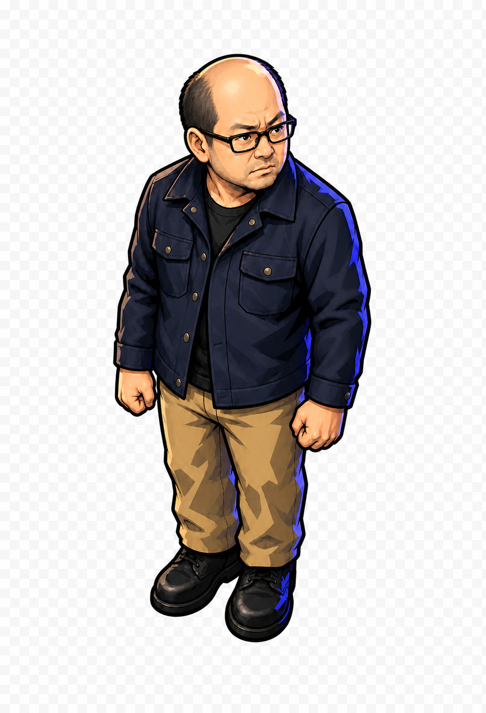

# 吾郎 canonical 下向きidle候補 Round 3

作成日: 2026-08-21  
生成方式: 組み込み画像生成  
状態: 旧案（横向きの顔・視線を含むため不採用）

## 成果物



ファイル: `assets/actors/goro/concepts/round3/goro-idle-down-canonical-draft-v1.png`

## 固定した要素

- Round 1 B案の中年男性らしい顔つき。
- 眉を寄せた警戒感のある表情。
- 黒い矩形眼鏡と後退した生え際。
- Round 2 B-Compact相当の約3頭身。
- 斜め上からの3/4見下ろし視点。
- 下向きidleとして使える狭い足幅。
- 濃紺のワークジャケット、ベージュのパンツ、黒い靴。
- 硬いセル影、濃い輪郭、青紫のリムライト。

## 透過検証

組み込み画像生成へ実透過を明示して3回試行した。

1. 新規canonical生成: 白背景をRGBへ焼き込み。
2. 白背景のbackground extraction: チェッカー背景をRGBへ焼き込み。
3. RGBA cutoutを強く指定した再生成: チェッカー背景をRGBへ焼き込み。

保存した候補は `RGB` であり、実アルファを持たない。デザイン比較には使用できるが、ゲームのランタイム画像としては使用しない。

次工程は、ユーザーの許可を得て背景だけを決定論的なローカル処理で透過するか、明示的にCLI/APIフォールバックを選択した後に行う。

## 主生成プロンプト

```text
Use case: stylized-concept
Asset type: canonical transparent game character sprite, Goro idle-down v1
Input images: Image 1 is the authoritative reference for Goro's mature face, furrowed brows, vigilant stern expression, black rectangular glasses, receding hairline, hard cel shading, dark outlines, cool blue-violet rim light, and dungeon-comic mood. Image 2 is the authoritative reference for compact approximately three-head-tall proportions, shorter limbs, top-down three-quarter camera, and compact footprint. Do not copy either input background.
Primary request: Create the canonical full-body idle-down game sprite of Goro by combining only Image 1's face, expression, style, palette and lighting with Image 2's compact proportions and camera angle.
Subject: the same middle-aged Japanese man with a bald crown and short dark side hair, black rectangular glasses, furrowed brows, serious alert sideways gaze, closed mouth, and sturdy broad-shouldered build; dark navy work jacket over a black shirt, tan trousers, black work shoes; arms resting naturally at the sides with lightly clenched fists; compact stable idle stance with feet close together around one ground anchor.
Style/medium: premium flat 2D cel-shaded Japanese action-game art; strong dark colored outer contour; simplified internal lines; hard angular two-step shadows; restrained sharp highlights; cool blue-violet rim edge; preserve the B concept's mature dungeon-comic atmosphere.
Composition/framing: single character only; full body fully visible; approximately three heads tall; three-quarter top-down view facing generally down toward the viewer and slightly right; head may turn slightly right while the body remains in idle-down orientation; feet centered closely around one clear foot-anchor point; generous empty transparent padding around the full silhouette.
Lighting/mood: hard upper-left key light; cool blue-violet rim light; vigilant, capable, slightly stern.
Constraints: output pixels outside the character silhouette must be genuinely transparent with alpha 0; do not draw or depict a transparency checkerboard; preserve clean antialiased edges and opaque character pixels; no floor; no background color; no scenery; no baked contact shadow; no text; no logo; no watermark; maintain readable face, glasses, fists and silhouette when displayed about 55 by 100 pixels.
Avoid: smiling, cute sparkling eyes, youthful face, childlike personality, five-head-tall or realistic adult proportions, wide combat lunge, photorealism, 3D rendering, toy or clay look, pixel art, soft airbrush-only shading, armor, weapon, cape, backpack, aura, extra characters.
```

## 透過再試行プロンプト

```text
Use case: background-extraction
Asset type: production-ready transparent game sprite, Goro idle-down canonical
Primary request: Render the same B-Compact Goro as a clean isolated production game sprite on a canvas whose entire background is actual transparent alpha. Do not render any visible background at all.
Transparency requirement: every pixel outside the character and its antialiased silhouette edge must have alpha value 0. The canvas must contain an RGBA character cutout only. Do not fill the canvas with white, black, gray, any gradient, or any pattern. Do not draw a checkerboard. Do not simulate transparency.
Constraints: no floor, no contact shadow, no aura, no exterior glow, no scenery, no text, no logo, no watermark; keep full body and generous transparent padding; readable at 55 by 100 pixels.
```

## 後継案

真下向きへ修正し、グリーンバックからPythonで実透過を作成した後継版を採用する。

- `docs/planning/prot3/goro-idle-down-canonical-v3.md`

## 透過後の予定（当時）

1. 透明境界を暗色と明色の背景で検査する。
2. 余白と足元アンカーを正規化する。
3. 55x100px前後でダンジョン画面へ仮配置する。
4. canonical採用後、上向きと右向きの制作へ進む。
