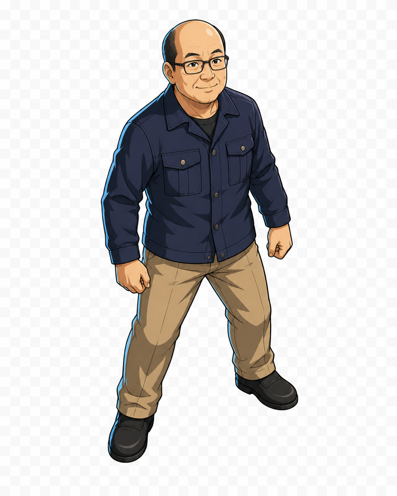
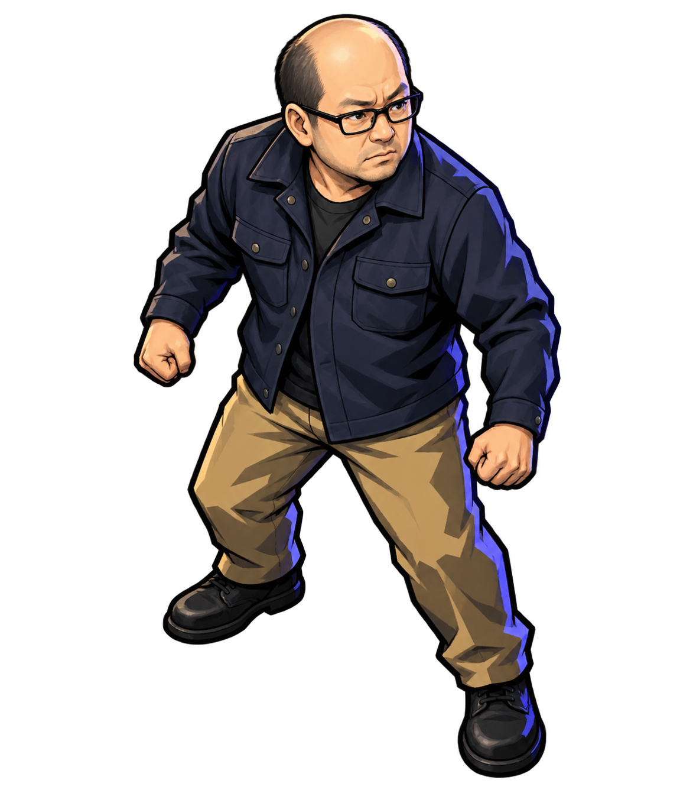
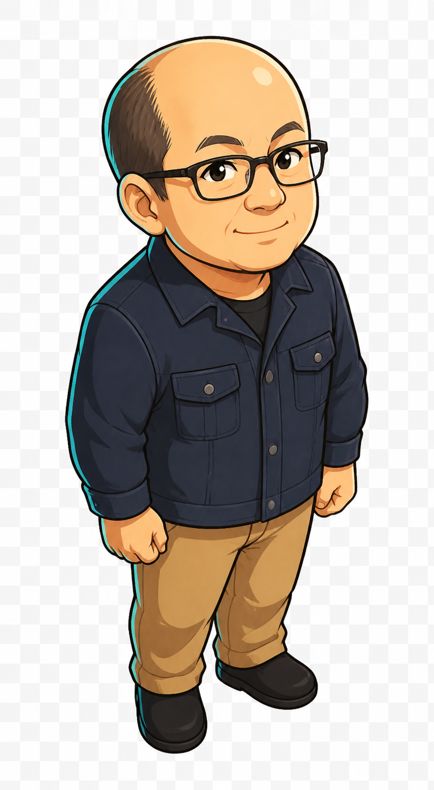

# 吾郎グラフィックス案 Round 1

作成日: 2026-08-21  
対象計画: `prot3-cel-shaded-character-graphics-plan.md`  
生成方式: 組み込み画像生成  
状態: コンセプト比較中・未採用

## 目的

Prototype 3のセルシェーディング方針に沿って、新しい吾郎の画風候補を比較する。

現行の `assets/materials/spritesheet.webp` は画風の参照に使用していない。`assets/materials/吾郎.png` と `assets/materials/goro.png` は、眼鏡、生え際、顔立ちなど人物の識別要素だけを参照するidentity referenceとして使用した。

## 共通条件

- 2Dアニメ調のセルシェーディング。
- 斜め上から見下ろす3/4視点。
- 全身表示。
- 濃紺のワークジャケット、ベージュのパンツ、黒い靴。
- 武器、鞄、帽子、マントなどの追加装備なし。
- 床、接地影、背景、文字、ロゴ、透かしなし。
- 小さいゲーム内表示でも、眼鏡とシルエットを読み取れることを目標とする。

## A案: 王道アニメゲーム



ファイル: `assets/actors/goro/concepts/round1/goro-concept-a-heroic-cel.png`

狙い:

- 親しみやすさと主人公らしさの両立。
- 標準的なアニメゲームの画面へ馴染む輪郭とセル塗り。
- 吾郎の人物識別性を比較的強く残す。

初期評価:

- 顔と眼鏡の読みやすさは高い。
- B案より柔らかく、C案より成人主人公らしい。
- 指定より頭身が高く、ゲーム用canonical制作時はさらに圧縮する必要がある。
- 生成画像は透明チェッカーがRGB背景へ焼き込まれているため、コンセプト比較専用。採用時は実透過で再制作する。

使用プロンプト:

```text
Use case: stylized-concept
Asset type: game character concept, Goro candidate A for a top-down dungeon crawler
Primary request: Create a completely new 2D anime cel-shaded character design of Goro. This is the clean, heroic, mainstream Japanese game-anime direction.
Input images: Image 1 and Image 2 are identity references only. Preserve the recognizable facial identity of the same middle-aged Japanese man: receding hairline with a bald crown, short dark hair at the sides, black rectangular glasses, rounded face. Do not copy the existing illustration style, proportions, pose, lighting, or 3D-like rendering.
Subject: full-body Goro in a dark navy work jacket, tan trousers, and simple black shoes; compact 2.5-to-3-head-tall proportions; friendly but determined expression; relaxed ready stance suitable for an idle game sprite; no weapon and no extra props.
Style/medium: polished 2D Japanese animation game character art; clean colored outlines; crisp two-to-three-step cel shading; restrained highlights; graphic color blocks; clearly hand-drawn 2D cel look, not a 3D render.
Composition/framing: single character, full body fully visible, three-quarter top-down game view, facing generally toward the viewer and slightly to the right, feet clearly visible and centered around one foot-anchor point, generous transparent padding around the silhouette.
Lighting/mood: consistent upper-left key light, subtle cool rim light for visibility in a dark dungeon, approachable adventurous mood.
Color palette: deep navy, warm tan, natural skin tones, small cool-blue edge accents.
Constraints: genuinely transparent background with preserved alpha; no floor; no scenery; no baked contact shadow; no text; no logo; no watermark; clear silhouette when reduced to about 55 by 100 pixels.
Avoid: photorealism, 3D toy rendering, clay look, pixel art, soft airbrush-only shading, exaggerated baby proportions, huge head, extra characters, weapons, bags, hats, capes, glowing effects.
```

## B案: ダンジョンコミック



ファイル: `assets/actors/goro/concepts/round1/goro-concept-b-dungeon-comic.png`

狙い:

- 硬い影と太い輪郭による、暗いダンジョンでの強い視認性。
- 戦闘時に頼もしさを感じる構えと体格。
- 紫青のリムライトによる背景分離。

初期評価:

- 3案の中で最も戦闘向けの迫力がある。
- 影の形と輪郭が強く、暗い背景に置きやすい。
- 表情が険しく、ゲーム全体のコミカルさを弱める可能性がある。
- 指定より頭身が高く、足が広いため、通常待機スプライトとしては占有面積の調整が必要。
- 実アルファを持つRGBA画像として生成されている。

使用プロンプト:

```text
Use case: stylized-concept
Asset type: game character concept, Goro candidate B for a top-down dungeon crawler
Primary request: Create a completely new high-contrast 2D cel-shaded design of Goro for a dark dungeon game. This candidate should feel graphic, compact, tough, and slightly comic-book-like while remaining Japanese anime game art.
Input images: Image 1 and Image 2 are identity references only. Preserve the recognizable facial identity of the same middle-aged Japanese man: receding hairline with bald crown, short dark hair at the sides, black rectangular glasses, rounded facial structure. Do not copy any existing rendered style, proportions, pose, lighting, or 3D treatment.
Subject: full-body Goro wearing a dark navy work jacket, tan trousers, and plain black shoes; an intentional compact three-head-tall silhouette with broad shoulders and short sturdy limbs; alert, determined expression; guarded idle stance with naturally clenched hands; no weapon and no extra props.
Style/medium: premium 2D cel-shaded action-game illustration; strong dark colored outer contour; simplified internal lines; hard angular two-step shadows; selective sharp highlights; bold readable color blocking; dramatic but clean manga-game finish; unequivocally flat 2D art.
Composition/framing: one character only, full body completely visible, three-quarter top-down game view, facing generally down and slightly right, feet close enough to read as one stable grid anchor, generous genuinely transparent padding.
Lighting/mood: hard upper-left key light, cool blue-violet rim accent, tense but not grim, suited to a dark-fantasy dungeon.
Color palette: near-black navy, muted ochre tan, warm skin, cool violet-blue accents.
Constraints: genuinely transparent background with alpha; no floor; no environment; no baked shadow; no text; no logo; no watermark; silhouette and glasses must remain readable around 55 by 100 pixels.
Avoid: photorealism, 3D render, toy or clay appearance, pixel art, watercolor, soft gradients dominating the rendering, five-head-tall proportions, oversized baby head, extra characters, weapons, armor, cape, backpack, glow aura.
```

## C案: ポップセル



ファイル: `assets/actors/goro/concepts/round1/goro-concept-c-pop-cel.png`

狙い:

- 小表示に強い、丸く単純化した形と大きな色面。
- 吾郎らしい親しみやすさとコミカルさ。
- 他モンスターも同じ頭身へ展開しやすいマスコット寄りの基準。

初期評価:

- 3案の中で最も3頭身に近く、ゲーム内サイズへの縮小に向く。
- 柔らかい表情と単純な色面が、ローグライクのコミカルさに合う。
- A/B案より人物の顔立ちが若く、可愛く寄っている。
- 強敵やダークな場面まで同じ画風で表現できるか、スライムとミニ悪魔ちゃんの試作で確認が必要。
- 生成画像は透明チェッカーがRGB背景へ焼き込まれているため、コンセプト比較専用。採用時は実透過で再制作する。

使用プロンプト:

```text
Use case: stylized-concept
Asset type: game character concept, Goro candidate C for a top-down dungeon crawler
Primary request: Create a completely new warm, playful, highly readable 2D anime cel-shaded design of Goro. This candidate is a polished pop-fantasy game mascot direction: charming and expressive, but still an adult dungeon adventurer rather than a child.
Input images: Image 1 and Image 2 are identity references only. Preserve the recognizable identity of the same middle-aged Japanese man: receding hairline and bald crown, short dark side hair, black rectangular glasses, rounded face. Do not copy the existing render style, proportions, pose, lighting, or 3D treatment.
Subject: full-body Goro wearing a simple dark navy work jacket, tan trousers, and plain black shoes; exactly about three heads tall from scalp to soles, with the head occupying roughly one third of total body height; rounded compact body, short sturdy legs and arms; lively intelligent eyes behind the glasses; small confident smile; relaxed adventurous idle stance; no weapon or extra props.
Style/medium: premium flat 2D anime game illustration; clean medium-weight colored outlines; simplified shapes; crisp two-step cel shading; minimal internal detail; lively manga expression; bold readable color areas; elegant modern character-design-sheet quality, unmistakably 2D.
Composition/framing: one character only, full body fully visible, three-quarter top-down game view, facing generally down and slightly right, feet close together around one stable grid anchor, generous genuinely transparent padding.
Lighting/mood: soft upper-left key light translated into crisp cel shapes, subtle turquoise rim accent, warm humorous adventurous mood.
Color palette: rich navy, warm caramel tan, warm skin tones, restrained turquoise accent.
Constraints: genuinely transparent background with preserved alpha; no floor; no scenery; no baked shadow; no text; no logo; no watermark; must remain clear and appealing around 55 by 100 pixels.
Avoid: photorealism, semi-realistic adult body proportions, 3D rendering, toy or clay look, pixel art, painterly brushwork, soft airbrush-only shading, infant or toddler appearance, huge baby head, extra characters, weapons, armor, cape, backpack, aura, magic effects.
```

## 比較まとめ

| 案 | 主な長所 | 主な課題 | 透過状態 |
|---|---|---|---|
| A | 主人公らしさと親しみやすさのバランス | 頭身をさらに圧縮したい | コンセプト背景がRGBへ焼き込み |
| B | 戦闘向けの迫力、暗所で強い輪郭 | 表情が重い、占有面積が大きい | 実アルファあり |
| C | 小表示への適性、コミカルさ | 若く可愛く寄り、ダーク表現の検証が必要 | コンセプト背景がRGBへ焼き込み |

## 次の判断

次工程では、次のいずれかを決める。

- A、B、Cのいずれかをそのまま基準にする。
- Aの顔とCの頭身など、明示した要素だけを組み合わせたRound 2を作る。
- 方向性を変更して新しい候補を作る。

基準案が決まるまでは、方向差分、攻撃ポーズ、ランタイム変換へ進まない。

