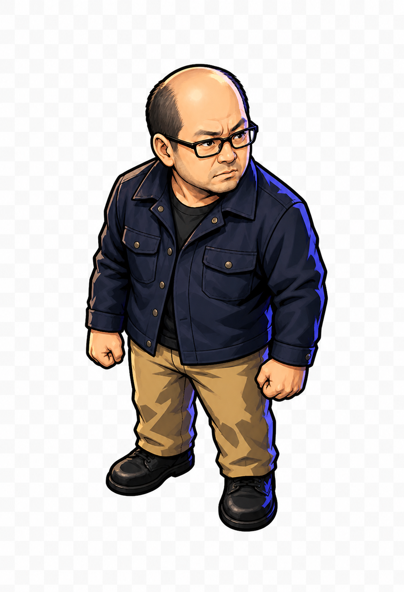

# 吾郎グラフィックス案 Round 2: B-Compact

作成日: 2026-08-21  
生成方式: 組み込み画像生成  
状態: コンセプト確認中・未採用

## ユーザーフィードバック

- Round 1ではB案を希望。
- B案を選ぶ主な理由は、顔つきと表情。
- B案はゲームキャラクターとして頭身が高すぎる懸念がある。
- B案の雰囲気と顔つきを保ち、C案程度の頭身にした案を希望。
- 斜め上からの見下ろし視点は、ゲームの最初のコンセプトに合っているため維持する。

## B-Compact案



ファイル: `assets/actors/goro/concepts/round2/goro-concept-b-compact-topdown.png`

### 変更したもの

- 全身を約3頭身へ圧縮。
- 胴、腕、脚を短くした。
- 足幅を狭め、1マスの足元アンカーへ合わせやすい構えにした。
- 斜め上からの3/4見下ろし視点を維持した。

### 維持したもの

- B案の中年男性らしい顔つき。
- 眉を寄せた警戒感のある表情。
- 横方向を見る真剣な視線。
- 黒い矩形眼鏡と後退した生え際。
- 濃紺のワークジャケットとベージュのパンツ。
- 硬いセル影、濃い輪郭、青紫のリムライト。

### 初期評価

- Round 1のB案よりゲーム用キャラクターとして収まりがよい。
- C案のような若い顔、笑顔、ポップな印象へ寄らず、B案の顔つきを概ね維持できている。
- 見下ろし角度によって頭部、肩、足元の位置関係が読みやすい。
- 生成結果は透明チェッカーがRGB背景へ焼き込まれているため、現時点ではコンセプト比較専用。
- 採用後のcanonical制作では、実透過、足元の正規化、実ゲームサイズでの輪郭確認が必要。

## 使用プロンプト

```text
Use case: identity-preserve
Asset type: compact game character concept, Goro candidate B-Compact
Input images: Image 1 is the edit target and the authoritative reference for face, facial expression, identity, linework, cel-shading style, lighting, colors, and overall mood. Image 2 is a proportions reference only for compact three-head-tall body scale; do not copy Image 2's face, eyes, smile, softer personality, line style, or turquoise palette.
Primary request: Change only the body proportions and stance of the Goro character in Image 1. Rebuild him as a compact approximately three-head-tall game character, comparable to Image 2's total head-to-body ratio, while keeping Image 1's mature face and guarded expression.
Required invariants from Image 1: preserve the exact middle-aged face impression; receding hairline and bald crown; black rectangular glasses; furrowed brows; serious sideways gaze; closed mouth; alert, slightly stern expression; strong dark outline; hard angular two-step cel shadows; cool blue-violet rim light; dark navy work jacket; black undershirt; tan trousers; black shoes; same top-down three-quarter camera angle.
Body change: shorten the torso, arms, and legs substantially; enlarge the head only as needed to reach a believable adult three-head-tall proportion; keep broad shoulders and sturdy build; retain naturally clenched fists; bring the feet closer together into a compact stable idle stance around one grid foot-anchor point; full body visible.
Style/medium: retain Image 1's premium 2D cel-shaded dungeon-comic anime game style exactly; bold graphic color blocking; dramatic but clean; not cute-eyed and not childlike.
Composition/framing: single full-body character, facing generally down and slightly right in a three-quarter top-down game view, centered with generous padding.
Constraints: change only proportions and stance; keep face, expression, identity, outfit, palette, lighting, linework, and cel shading unchanged; genuinely transparent background with real alpha; no floor; no scenery; no baked shadow; no text; no logo; no watermark; readable around 55 by 100 pixels.
Avoid: Image 2's smiling face, large sparkling eyes, youthful appearance, soft pop mood, photorealism, 3D rendering, toy or clay look, pixel art, armor, weapons, cape, backpack, aura, extra characters.
```

## 採用後の次工程

1. B-Compactをcanonical designとして確定する。
2. 背景を実アルファにした下向きidle画像を制作する。
3. 55x100px前後へ縮小したゲーム内モックで輪郭と表情を確認する。
4. 同じ顔、頭身、見下ろし角度を固定して上向きと右向きを制作する。
5. 左向きは右向きの反転を基本とする。

