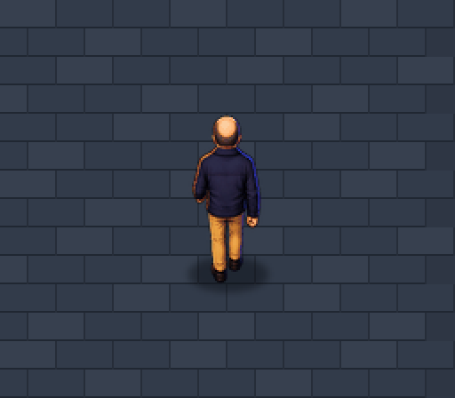
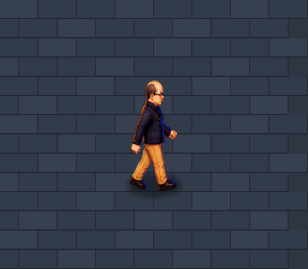
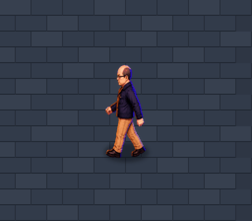

# 吾郎 方向別idle・歩行セット v1

作成日: 2026-08-21  
生成方式: 組み込み画像生成 + 純緑背景 + Pythonクロマキー処理 + 反転後の再照明  
状態: 下・上は2相、右・左はpassingを含む4相歩行を制作、実寸QA済み

## 採用する動作規則

下・上方向は接地2相、横方向は接地とpassingを交互に表示する4相とする。

```text
下・上: 接地A → 接地B → 接地A …
右・左: 接地A → passing B → 接地B → passing A → 接地A …
停止時: 現在の歩行相 → 方向別idle
```

idleは入力のない静止状態だけに使い、歩行周期の中間には挟まない。横方向のpassingは直立に近い細いシルエットだが、片足が浮き、支持脚へ重心が乗り、腕も移動中の非対称姿勢である。idleを歩行へ流用したものではない。

## 方向とポーズ

| 方向 | idle | 相1 | 相2 | 相3 | 相4 |
|---|---|---|---|---|---|
| 下 | 真下へ正対 | 右足接地 | 左足接地 | ― | ― |
| 上 | 真上へ進む背面 | 右足接地 | 左足接地 | ― | ― |
| 右 | 真横の右向き | 右脚接地・左腕前 | 左脚passing | 左脚接地・右腕前 | 右脚passing |
| 左 | 真横の左向き | 右脚接地・左腕前 | 左脚passing | 左脚接地・右腕前 | 右脚passing |

左右方向は右向きを形状マスターとし、左向きは水平反転でポーズを確定してから画像生成で再照明した。これにより、向きだけは対称、照明は全方向で画面左が暖色・画面右が青紫のままになる。

## ランタイム契約

- 形式: RGBA lossless WebP。
- キャンバス: 全フレーム共通 `260 × 400 px`。
- 基準点: 透明キャンバス中央下。
- QA描画サイズ: `55 × 100 px`。
- 接地影: 画像へ焼き込まずCanvas側で描画する。
- 背景処理: 生成時は純緑 `#00FF00`、採用時に `tools/remove_chroma_key.py` で透過・despillする。

共通キャンバスを縮小描画することで、横向きの広い歩幅と細いidleの間でもキャラクター倍率を一定に保つ。足元を下端へ揃えるため、歩行中の不要な上下動も抑える。

### 方向ごとのコマ数と再生時間

方向ごとにコマ数が異なっても、同じ足が再接地するまでの1周期を共通の `360 ms` とする。

| 方向 | コマ数 | 1コマ | 1周期 |
|---|---:|---:|---:|
| 下・上 | 2 | 180 ms | 360 ms |
| 右・左 | 4 | 90 ms | 360 ms |

横方向のpassingは、前後方向に存在しない追加の時間ではなく、2つの接地間隔 `180 ms` を半分に分ける中間姿勢である。このため、横方向だけ歩調や移動速度が遅くなることはない。

ゲーム実装では「全方向で同じフレームduration」を持たせず、clipごと、またはフレームごとのdurationを定義する。移動距離はアニメーションのコマ数から計算せず、既存の移動ロジックを基準とする。

## ランタイム素材

### 下

- `assets/actors/goro/runtime/goro-idle-down-v3.webp`
- `assets/actors/goro/runtime/goro-walk-down-right-foot-forward-v1.webp`
- `assets/actors/goro/runtime/goro-walk-down-left-foot-forward-relit-v1.webp`

### 上

- `assets/actors/goro/runtime/goro-idle-up-v2.webp`
- `assets/actors/goro/runtime/goro-walk-up-right-foot-forward-v1.webp`
- `assets/actors/goro/runtime/goro-walk-up-left-foot-forward-relit-v1.webp`

### 右

- `assets/actors/goro/runtime/goro-idle-right-v1.webp`
- `assets/actors/goro/runtime/goro-walk-right-contact-right-leg-left-arm-forward-v3.webp`
- `assets/actors/goro/runtime/goro-walk-right-passing-left-leg-v1.webp`
- `assets/actors/goro/runtime/goro-walk-right-contact-left-leg-right-arm-forward-v3.webp`
- `assets/actors/goro/runtime/goro-walk-right-passing-right-leg-v1.webp`

### 左

- `assets/actors/goro/runtime/goro-idle-left-relit-v1.webp`
- `assets/actors/goro/runtime/goro-walk-left-contact-right-leg-left-arm-forward-relit-v3.webp`
- `assets/actors/goro/runtime/goro-walk-left-passing-left-leg-relit-v1.webp`
- `assets/actors/goro/runtime/goro-walk-left-contact-left-leg-right-arm-forward-relit-v3.webp`
- `assets/actors/goro/runtime/goro-walk-left-passing-right-leg-relit-v1.webp`

各素材の透過canonical PNGと生成時のグリーンバック原画は、それぞれ `assets/actors/goro/source/` と `assets/actors/goro/source/chroma/` に保存する。

### 横向きv1の不採用理由

初回の横向き2枚は、腕の曲げ方に差はあったものの、肩と股関節で前後の手足が入れ替わっておらず、両方とも同じ手足が前に出ていた。これは2相歩行として成立しないため不採用とした。

誤ってゲームへ組み込まれないよう、旧v1ランタイム素材は `assets/actors/goro/concepts/walk-tests/side-same-limb-rejected/runtime/` へ移動した。

v2ではファイル名にも解剖学的な組み合わせを明記し、同側手足問題を修正した。しかし接地ポーズ2枚だけでは、実寸時に開脚シルエットの中で腕だけが切り替わるように見え、歩行としての重心移動を読み取れなかったため、これも不採用とした。

旧v2ランタイム素材とQA GIFは、それぞれ以下へ退避した。

- `assets/actors/goro/concepts/walk-tests/side-contact-only-rejected/runtime/`
- `docs/planning/prot3/rejected/side-contact-only-v2/`

採用する横方向v3では、次の4相を画像単体とGIFの両方で確認する。

```text
右脚接地・左腕前
→ 左脚passing
→ 左脚接地・右腕前
→ 右脚passing
```

接地相の歩幅はv2より約30%狭めた。passing相では脚の横幅を閉じ、片方の靴だけを浮かせる。これにより実寸でも「開く→閉じる→開く→閉じる」という重心移動を読めることを採否基準とする。

## 実寸QA

GIF内では `55 × 100 px` で描画し、確認しやすいよう画面全体だけを2倍表示している。

### 上向き



### 右向き



### 左向き



開始・歩行・停止の遷移確認用GIFも各方向に用意した。

- `docs/planning/prot3/goro-walk-up-start-walk-stop.gif`
- `docs/planning/prot3/goro-walk-right-start-walk-stop.gif`
- `docs/planning/prot3/goro-walk-left-start-walk-stop.gif`
- 生成スクリプト: `tools/build_goro_walk_preview.py`

## 生成・編集プロンプトの要点

- 承認済み吾郎の顔、険しい表情、眼鏡、衣装、セルシェーディングを固定する。
- 上向きは見下ろし背面、左右は斜めを向かない真横の側面とする。
- 横方向は接地2枚とpassing 2枚を独立して制作する。
- passingでは支持脚を腰の下へ置き、振出脚の膝を曲げ、靴を足首付近で床から浮かせる。
- passingの細いシルエットをidleへ寄せず、前傾、片足荷重、非対称な腕で移動中と分かるようにする。
- 純緑 `#00FF00` の均一背景とし、床、接地影、文字を入れない。
- 左向きは反転画像を正確な形状参照、右向き画像を照明参照として再照明する。

## 次の作業

方向別clipの登録、歩行位相制御、停止時idle、ゲーム内実寸確認は完了した。

方向別攻撃ポーズの制作と旧スプライトシートのフォールバック撤去も完了した。詳細は `goro-attack-set-v1.md` を参照する。

次はスライムとミニ悪魔ちゃんのパイロット制作へ進む。
