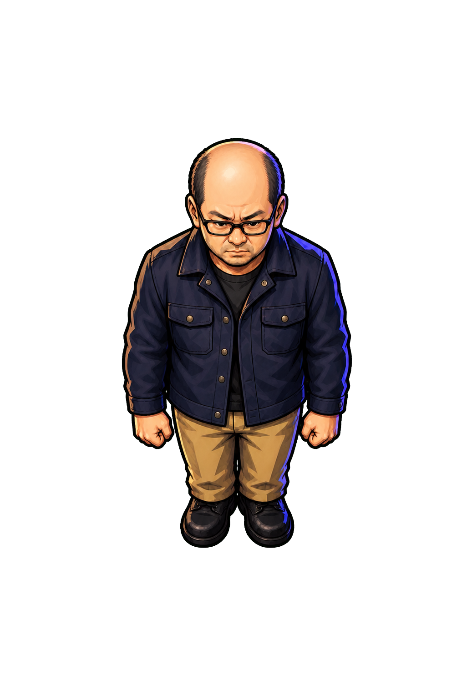

# 吾郎 idle-down canonical v3

作成日: 2026-08-21  
生成方式: 組み込み画像生成 + Pythonクロマキー処理  
状態: `idle-down` 基準案・ゲーム実寸確認済み

## 採用案



- 正面下方向（画面下端）へ、頭・鼻・視線・胴体を揃える。
- 左右の耳、眼鏡、肩が対称に見える真下向き。
- Round 1 B案の中年男性らしい顔、険しい眉、警戒した表情を維持する。
- Round 1 C案に近い、約3頭身のコンパクトな体格とする。
- 濃紺のワークジャケット、ベージュのパンツ、黒い靴を基準衣装とする。
- 硬いセル影、濃色の輪郭、青紫のリムライトを共通画法とする。

旧Round 3案の「顔だけを右へ振る」指定は、移動方向と視線方向が食い違って見えるため撤回した。下向きスプライトでは横向きの顔・視線を使わない。

## 成果物

- グリーンバック原画: `assets/actors/goro/source/chroma/goro-idle-down-green-v2.png`
- 透過canonical PNG: `assets/actors/goro/source/goro-idle-down-canonical-v3.png`
- ゲーム用lossless WebP: `assets/actors/goro/runtime/goro-idle-down-v3.webp`
- 背景除去スクリプト: `tools/remove_chroma_key.py`
- 実寸表示確認: `docs/planning/prot3/goro-idle-down-qa.html`

## 背景除去

画像生成時は背景を一様な純緑 `#00FF00` とし、実透過は生成AIに任せずPythonで作る。

```powershell
python tools/remove_chroma_key.py `
  assets/actors/goro/source/chroma/goro-idle-down-green-v2.png `
  assets/actors/goro/source/goro-idle-down-canonical-v3.png `
  --opaque-excess 10 --transparent-excess 160 --despill 1

python tools/remove_chroma_key.py `
  assets/actors/goro/source/chroma/goro-idle-down-green-v2.png `
  assets/actors/goro/runtime/goro-idle-down-v3.webp `
  --opaque-excess 10 --transparent-excess 160 --despill 1 `
  --trim --padding 32 --max-height 400
```

canonical PNGは `1037 × 1517`、ランタイムWebPは `236 × 400`。両方ともRGBAで、背景はalpha 0、キャラクター本体はalpha 255、境界のみ中間alphaを持つ。

## 実寸確認

ゲーム想定の `55 × 100 px` と、その2倍表示を既存床タイル上で確認した。

- 禿頭、黒い眼鏡、険しい眉、紺ジャケット、ベージュのパンツを識別できる。
- 頭・鼻・視線・肩の左右対称性により、真下向きと読める。
- 緑のフリンジは暗色床上で目立たない。
- 55px幅では細かな瞳より、眉・眼鏡・口元・頭部シルエットで表情を伝える。

## 次工程

1. 同じ頭部・衣装・比率を固定し、`idle-up` を作る。
2. `idle-right` を作り、`idle-left` は必要に応じて反転運用を検証する。
3. 3方向の視点と光源方向が揃った段階で、歩行フレームへ展開する。

