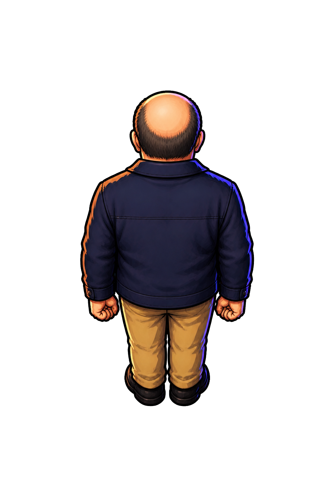

# 吾郎 idle-up canonical v2

作成日: 2026-08-21  
生成方式: 組み込み画像生成 + Pythonクロマキー処理  
状態: `idle-up` 基準案・ゲーム実寸確認済み

## 採用案



- 頭、首、背骨、肩、腰、足を画面上方向へ揃えた完全な背面図。
- 左右へ振り返らず、顔、眼鏡レンズ、鼻、口を見せない。
- `idle-down v3` と同じ約3頭身、肩幅、衣装、輪郭線、セル影を維持する。
- 禿げ上がった頭頂と後頭部の短い側頭・後頭部の髪で吾郎を識別する。
- 濃紺のワークジャケット背面、ベージュのパンツ、黒い靴を見せる。
- 暖色の左上光と青紫の右側リムライトを維持する。

## 成果物

- グリーンバック原画: `assets/actors/goro/source/chroma/goro-idle-up-green-v1.png`
- 透過canonical PNG: `assets/actors/goro/source/goro-idle-up-canonical-v2.png`
- ゲーム用lossless WebP: `assets/actors/goro/runtime/goro-idle-up-v2.webp`
- 方向比較ページ: `docs/planning/prot3/goro-idle-direction-qa.html`

## 背景除去

`idle-down` と同じクロマキー設定を使用した。

```powershell
python tools/remove_chroma_key.py `
  assets/actors/goro/source/chroma/goro-idle-up-green-v1.png `
  assets/actors/goro/source/goro-idle-up-canonical-v2.png `
  --opaque-excess 10 --transparent-excess 160 --despill 1

python tools/remove_chroma_key.py `
  assets/actors/goro/source/chroma/goro-idle-up-green-v1.png `
  assets/actors/goro/runtime/goro-idle-up-v2.webp `
  --opaque-excess 10 --transparent-excess 160 --despill 1 `
  --trim --padding 32 --max-height 400
```

canonical PNGは `1037 × 1517`、ランタイムWebPは `231 × 400`。両方ともRGBAで、背景はalpha 0、キャラクター本体はalpha 255、境界のみ中間alphaを持つ。

## 実寸確認

`idle-down v3` と並べ、既存床タイル上の `55 × 100 px` で確認した。

- 身長、肩幅、頭部サイズ、足元アンカーが概ね一致する。
- 後頭部、襟、ジャケット背面により、画面上向きと即座に判別できる。
- 暗色床上で緑のフリンジは目立たない。
- 前面と背面のディテール量の差は、ゲーム実寸では自然な方向差として読める。

## 生成プロンプト

```text
Use case: precise-object-edit
Asset type: Prototype 3 game character sprite, Goro idle-up canonical source on chroma green
Input image: Image 1 is the authoritative edit target and identity/style reference. Preserve this exact character's compact proportions, physique, clothing design, palette, outline weight, cel-shading language, and blue-violet rim light.
Primary request: Reconstruct the same Goro character as a full-body BACK VIEW facing exactly toward the TOP CENTER of the canvas for the game's idle-up direction. This is a new reverse-angle drawing of the same character, not a mirror and not a rotation of the flat picture.
Scene/backdrop: perfectly uniform solid chroma green RGB #00FF00 across every background pixel, with no gradient, texture, shadow, floor, vignette, noise, or color variation.
Subject: the same compact middle-aged Japanese man, approximately three heads tall, sturdy broad-shouldered build; bald crown and back of bald head clearly visible from the elevated camera, short dark hair around the sides and rear; dark navy work jacket seen from behind with the same collar, seams, cuffs and waist; tan trousers; black work shoes; arms resting symmetrically at his sides with lightly clenched hands.
Style/medium: premium flat 2D Japanese action-game cel shading; strong dark colored contour; simplified internal lines; hard angular two-step shadows; restrained sharp highlights; cool blue-violet rim edge; match Image 1 exactly.
Composition/framing: single character only, centered full body, same character scale and approximately three-head-tall proportions as Image 1; high three-quarter top-down game camera; the head, neck, spine, shoulders, hips and feet all point straight upward toward the top center; perfectly symmetric idle-up orientation; both shoulders and both ears visible evenly; narrow stable foot placement around one ground anchor; generous green padding around silhouette.
Constraints: show only the back of head and back of body; no visible face, eyes, nose, mouth, glasses lenses, shirt front, jacket buttons, chest pockets, fly, or front trouser details; do not turn or glance left or right; no three-quarter sideways yaw; no profile; no asymmetrical shoulder twist; no walking stride; no floor; no cast shadow; no extra objects; no text; no logo; no watermark.
```

## 次工程

`idle-down` と `idle-up` を基準に、右向きの `idle-right` を制作する。右向きでは正面・背面案より横幅が狭くなるため、頭部サイズと足元アンカーを優先して統一する。
