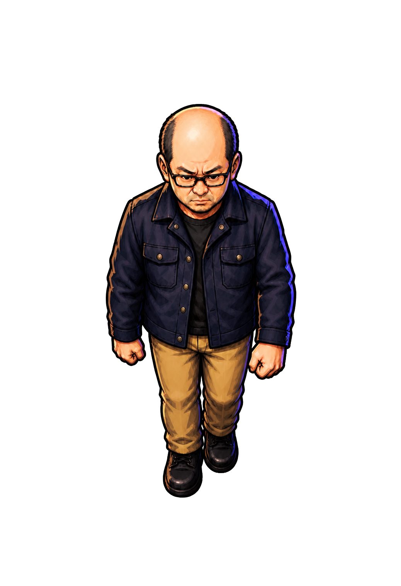
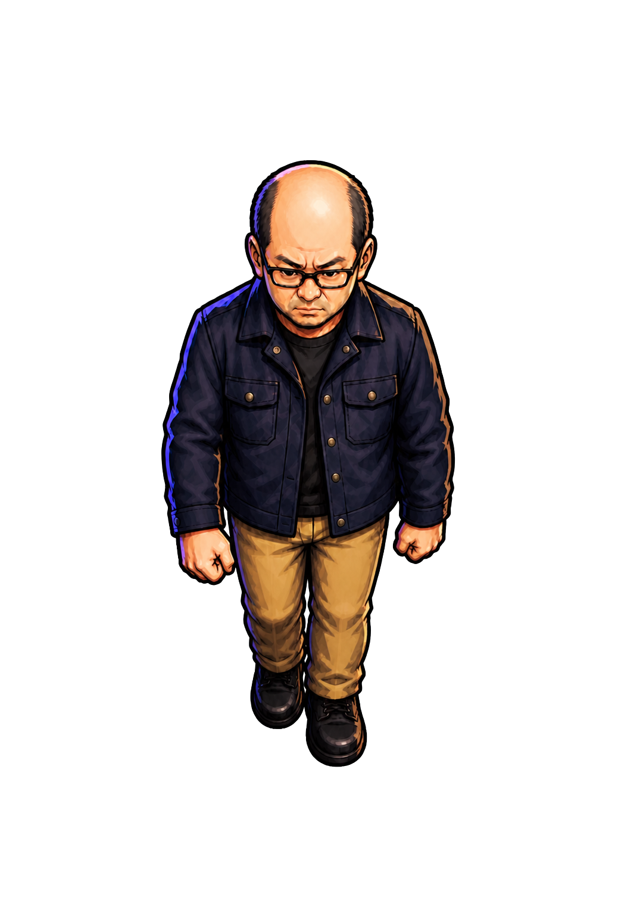
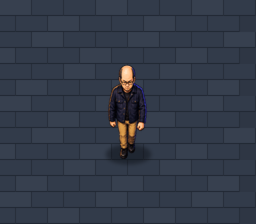

# 吾郎 walk-down パイロット v1

作成日: 2026-08-21  
生成方式: 組み込み画像生成 + Pythonクロマキー処理 + 水平反転  
状態: 下向き歩行の接地ポーズ2相・固定光源版を作成、実寸ループ比較済み

## 歩行構成

1枚だけ生成し、逆相は水平反転で作る。

```text
移動中: 右足前・左手前 ⇄ 左足前・右手前
停止中: idle-down
```

正面から見た画面上の左右と、吾郎本人の左右を混同しない。

- 右足前・左手前: 吾郎の右足は画面左、吾郎の左手は画面右。
- 左足前・右手前: 上記を画像全体で水平反転したもの。

`idle-down` は速度ゼロの静止姿勢であり、歩行周期へ挟まない。実際の人間の歩行で左右の接地姿勢の間に存在するのはpassing poseであってidleではない。Prototype 3の初期実装はpassing poseを省略した2相歩行とし、入力がなくなった時だけidle-downへ戻す。

将来4相へ増やす場合は次の構成とする。

```text
右足接地 → 左足passing → 左足接地 → 右足passing
```

## 成果物

### 生成側：右足前・左手前



- グリーンバック原画: `assets/actors/goro/source/chroma/goro-walk-down-right-foot-forward-green-v1.png`
- 透過canonical PNG: `assets/actors/goro/source/goro-walk-down-right-foot-forward-canonical-v1.png`
- ゲーム用lossless WebP: `assets/actors/goro/runtime/goro-walk-down-right-foot-forward-v1.webp`

### 反転側：左足前・右手前



- 透過canonical PNG: `assets/actors/goro/source/goro-walk-down-left-foot-forward-canonical-v1.png`
- ゲーム用lossless WebP: `assets/actors/goro/runtime/goro-walk-down-left-foot-forward-v1.webp`

## 反転処理

`tools/remove_chroma_key.py` に `--flip-x` を追加した。クロマキー、トリミング、縮小後に水平反転するため、2相の寸法と足元余白は完全に一致する。

```powershell
python tools/remove_chroma_key.py `
  assets/actors/goro/source/chroma/goro-walk-down-right-foot-forward-green-v1.png `
  assets/actors/goro/runtime/goro-walk-down-left-foot-forward-v1.webp `
  --opaque-excess 10 --transparent-excess 160 --despill 1 `
  --trim --padding 32 --max-height 400 --flip-x
```

全方向を追加した時点で、ランタイム画像は共通の `260 × 400` RGBA lossless WebPへ再正規化した。透明キャンバスの中央下を足元基準とするため、idleと歩行で元画像の横幅が異なっても表示倍率は変わらない。

## 反転に関する判断

反転すると青紫のリムライトと暖色ハイライトも左右反転する。実寸ループでは、頭頂部と肩の高コントラストな色が左右交互に切り替わり、足運びより先に照明の点滅を感じた。

そのため、単純反転版を形状リファレンス、右足前版を画面内光源リファレンスとして、左足前ポーズを再照明した。

- 再照明グリーンバック: `assets/actors/goro/source/chroma/goro-walk-down-left-foot-forward-relit-green-v1.png`
- 再照明canonical PNG: `assets/actors/goro/source/goro-walk-down-left-foot-forward-relit-canonical-v1.png`
- 再照明ランタイムWebP: `assets/actors/goro/runtime/goro-walk-down-left-foot-forward-relit-v1.webp`

再照明版では、右足前版・idle版と同じく画面左を暖色、画面右を青紫に固定する。再生成による輪郭や細部の差は実寸で小さく、単純反転時の照明点滅より目立たないため、ランタイム採用候補は再照明版とする。

## 実寸ループ比較

初回比較ではidleを挟む4拍を使用したが、毎歩ごとに重心移動が止まるため不採用とした。採用候補は、キャラクターを `55 × 100 px` で床上へ配置し、右足前と左足前だけを交互表示する2相歩行である。GIFは見やすさのため画面全体を2倍表示している。

### 単純反転



### 画面固定光源


- 単純反転版: `docs/planning/prot3/goro-walk-down-raw-flip.gif`
- 固定光源版: `docs/planning/prot3/goro-walk-down-fixed-light.gif`
- 固定光源2相歩行: `docs/planning/prot3/goro-walk-down-two-phase-fixed-light.gif`
- 開始・歩行・停止: `docs/planning/prot3/goro-walk-down-start-walk-stop.gif`
- 生成スクリプト: `tools/build_goro_walk_preview.py`

## 生成プロンプトの要点

- `idle-down v3` の顔、頭身、衣装、真下向き、画風を固定。
- 吾郎の右足（画面左）と左手（画面右）を前へ出す。
- 右手と左足は後ろへ引く。
- 歩幅は靴半分程度の差に抑える。
- 走り、突進、攻撃、横向き、顔の向き変更を禁止する。
- 背景を一様な純緑 `#00FF00` とする。

## 次の検証

- 固定光源版の2相ループを実ゲームの移動距離へ同期し、足滑りを確認する。
- 入力終了時だけidle-downへ戻し、停止時の切替を確認する。
- 上・左右方向への展開結果は `goro-directional-walk-set-v1.md` を参照する。

## 不採用試作: wide standing

上下動を抑える検討として、両足を横へ開き、両靴底をほぼ同じ高さに置いた姿勢も生成した。しかしこれはpassing poseでも接地の切替でもなく、歩行中には現れないstanding poseであるため不採用とした。

試作物はランタイム候補から外し、`assets/actors/goro/concepts/walk-tests/wide-standing-rejected/` に保存する。
